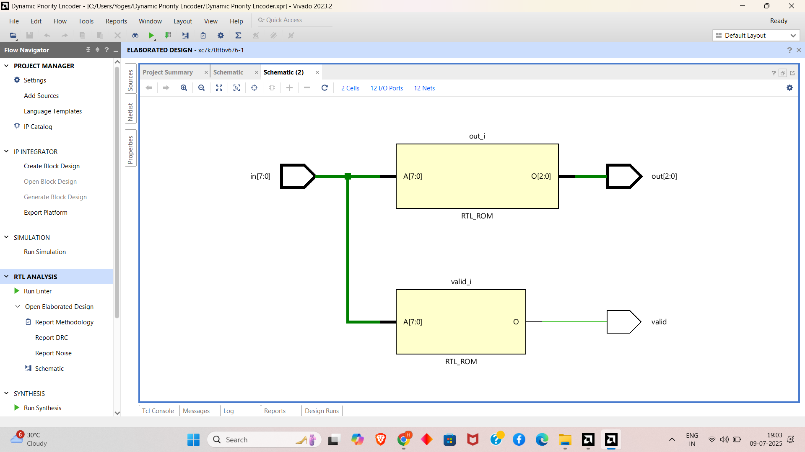

# priority-encoder-barrel-shifter-verilog
Verilog-based FPGA project implementing an 8-to-3 Dynamic Priority Encoder and an 8-bit Barrel Shifter, designed for Prism Studio’s FPGA Prototyping Internship. The project focuses on clean RTL modeling, waveform simulation, and combinational logic design using Vivado 2023.2. 


# FPGA Priority Encoder & Barrel Shifter | Prism Studio Internship Task

Welcome to the **FPGA Combinational Logic** project! This design uses Verilog to implement two fundamental digital components: the **Dynamic Priority Encoder** and the **Barrel Shifter**. These circuits are crucial in real-time signal routing, data prioritization, and processing systems used in embedded and FPGA environments.

Whether you're diving into RTL design or preparing for practical FPGA logic implementation, this project helps you master combinational circuit design, simulation, and documentation — an ideal internship or course project.

---

## 🧠 Project Overview

This project was developed as part of the **Prism Studio Embedded R&D Internship**. The goal is to design and validate two combinational logic circuits that are core to signal routing and shifting in embedded processors and communication modules.

### 🎯 Objectives

- **Design**: Create Verilog logic for a priority encoder and barrel shifter.
- **Simulate**: Verify output accuracy through testbenches and waveform analysis.
- **Optimize**: Ensure RTL logic is clean, hardware-efficient, and synthesizable.
- **Document**: Share the results using waveform screenshots and schematics.

---

## 💡 Features

### Dynamic Priority Encoder

- Outputs binary index of the highest active input (MSB priority).
- 8-bit input → 3-bit output (`out`) with `valid` flag.
- Handles edge case when no input is high.

### Barrel Shifter

- 8-bit logical left or right shifter.
- Direction control: `dir = 0` for left, `dir = 1` for right.
- Variable shift amount via `shift_amt[2:0]`.

---

## 🗂️ Repository Structure

| File | Description |
|------|-------------|
| `priority_encoder_8to3.v` | Verilog RTL for the priority encoder |
| `tb_priority_encoder.v` | Testbench for the encoder |
| `barrel_shifter.v` | Verilog RTL for barrel shifter |
| `tb_barrel_shifter.v` | Testbench for the shifter |
| `README.md` | Project documentation |
| `screenshots/` | Waveform outputs and optional schematic images |

---

## 🧰 Requirements

- **Software**: Vivado 2023.2 (or any simulator supporting Verilog-2001)
- **Skills**: Basic Verilog, combinational logic, waveform interpretation

---

## ⚙️ Setup Instructions

### 1. Clone the Repository

```bash
git clone https://github.com/your-username/fpga-combinational-task2.git
cd fpga-combinational-task2
```

### 2. Run Simulation

- Open Vivado or ModelSim
- Add:
  - `priority_encoder_8to3.v` & `tb_priority_encoder.v`
  - `barrel_shifter.v` & `tb_barrel_shifter.v`
- Run behavioral simulation and observe waveforms

---

## 🔬 Implementation Details

### Priority Encoder

- Inputs: `in[7:0]`
- Output: `out[2:0]` + `valid`
- Uses `casex` to detect the first high bit (MSB priority)

### 📊 Example Output

| Input (`in[7:0]`) | Output (`out`) | Valid |
|------------------|----------------|--------|
| `00000000`       | `000`          | `0`    |
| `00000001`       | `000`          | `1`    |
| `10000000`       | `111`          | `1`    |

---

###  Barrel Shifter

- Inputs: `dat_i[7:0]`, `dir`, `shift_amt[2:0]`
- Output: `data_out[7:0]`
- Performs `data_in << shift_amt` or `data_in >> shift_amt` based on `dir`

### 📊 Example Shifts

| Input | Shift Amt | Dir | Output |
|-------|-----------|-----|--------|
| `10101010` | 3 | 0 | `01010000` |
| `11110000` | 2 | 1 | `00111100` |
| `00000001` | 7 | 0 | `10000000` |
| `10000000` | 7 | 1 | `00000001` |

---

### 🔸 Priority Encoder
---
## 🔍 Simulation Output


---
## 🔍 schematic Output


---
### 🔸 Barrel Shifter
---
## 🔍 Simulation Output


---
## 🔍 schematic Output


---

## 🌱 Learning Outcomes

- Understanding MSB-based dynamic encoding
- Designing shift logic using behavioral modeling
- Working with fully combinational modules in Verilog
- Creating clean testbenches with edge case coverage

---

## 🌟 Future Scope

- Extend encoder to 16-bit with enable control
- Add arithmetic shift support in barrel shifter
- Convert into synthesizable IP cores with AXI interface

---

## 📜 License

This project is licensed under the MIT License.

---

## 🙌 Acknowledgments

- Internship Task from **Prism Studio**
- Developed and simulated using **Vivado 2023.2**
- Thanks to the open-source FPGA learning community!

Happy designing, and keep shifting signals smartly! 🔄💡
